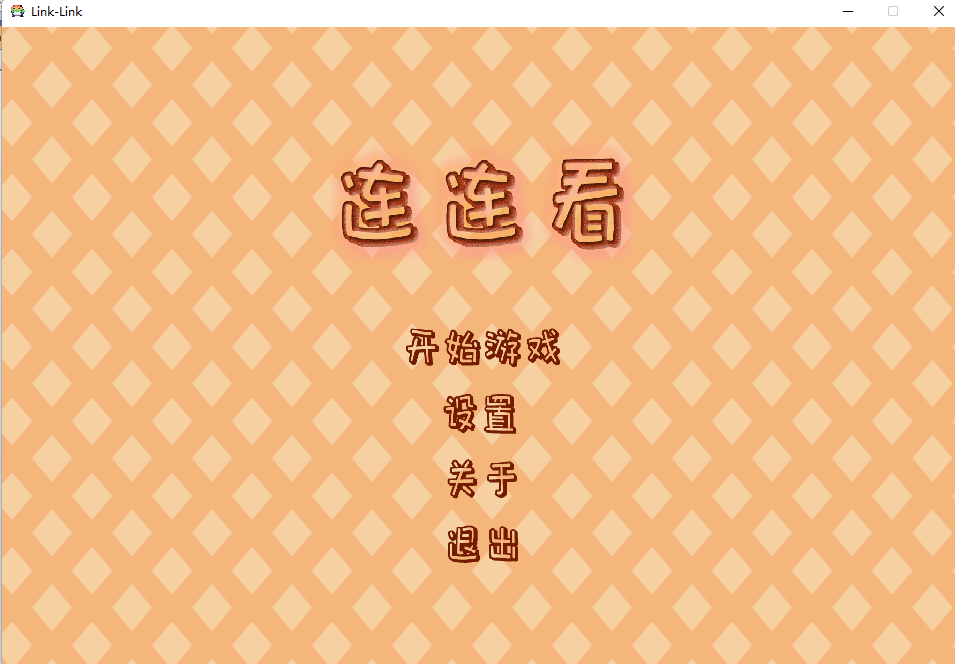

# 连连看

> 北京邮电大学 计算机学院（国家示范性软件学院）软件工程专业
>
> 《基于C/C++语言的编程设计》课程作业
>
> 2020.06.30-2020.07.03

### 游戏简介

### 游戏规则

> 此处忽略连连看的基础规则



### 游戏关卡

进入游戏后，分为六个关卡，其中关卡三和关卡六开启了重力模式。


### 游戏界面


在关卡结束之后会判定用时情况。


## 编译方式

#### 前期准备

你需要在环境中安装好：

- libsdl2-dev
- libsdl2-mixer-dev
- libsdl2-image-dev
- libsdl2-ttf-dev

#### 编译软件

进入 `Link-Link` 文件夹后，直接运行写好的 `Makefile` 文件：

```shell
make
```

随后会产生二进制文件，名字为 `main` 。

#### 运行软件

直接运行对应的二进制文件即可。
